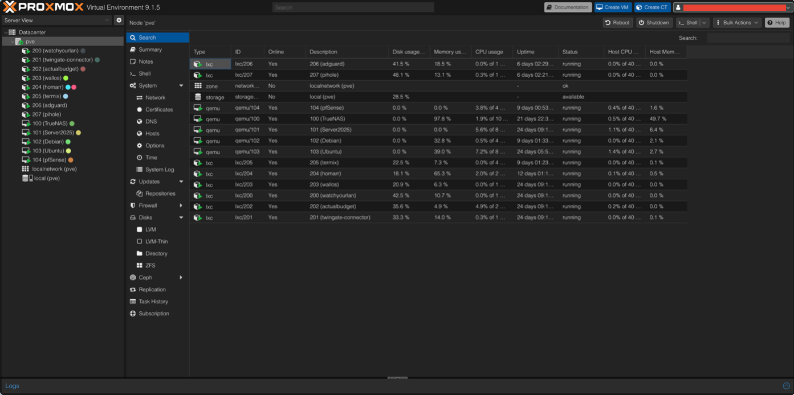
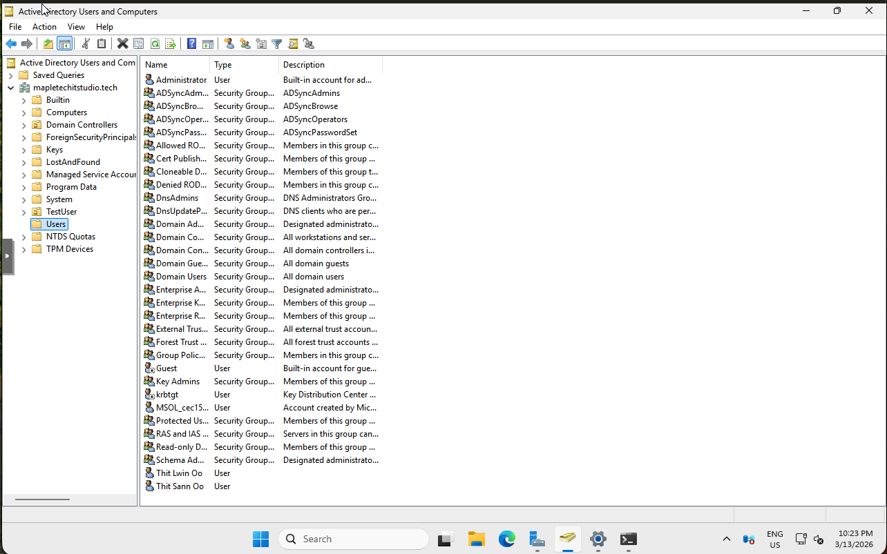

# 🏗 Hybrid Enterprise Infrastructure Homelab


An enterprise-style hybrid infrastructure lab designed to simulate a **small business IT environment**.  
This project demonstrates practical experience in **systems administration, networking, identity management, and security architecture** by integrating on-premises infrastructure with cloud identity services.

The environment focuses on implementing modern enterprise practices such as **centralized identity governance, defense-in-depth security, and controlled remote access**.

---

# 🌐 Architecture Overview

The infrastructure is hosted on a **Dell PowerEdge R720** running **Proxmox VE** as the virtualization platform. Core infrastructure services are deployed as virtual machines to simulate a real enterprise environment.

The environment integrates:

- On-prem infrastructure services
- Hybrid identity with Microsoft Entra ID
- Firewall-enforced network boundary protection
- Centralized storage with directory-based access control
- Secure remote access without exposing internal services

---

# 🧰 Core Infrastructure Components

| Layer | Technology |
|------|-------------|
| Virtualization | Proxmox VE |
| Firewall & Gateway | pfSense |
| Identity Authority | Windows Server (Active Directory) |
| Cloud Identity | Microsoft Entra ID |
| Hybrid Identity Sync | Azure AD Connect |
| Storage | TrueNAS (ZFS) |
| Secure Remote Access | Twingate |

---

# 🛡 Security Architecture

The environment follows a **defense-in-depth security model**, implementing multiple layers of protection across the infrastructure.

Security controls include:

- **Firewall Boundary Protection** – pfSense enforces deny-by-default inbound rules and NAT routing.
- **Identity-Based Access Control** – Authentication managed through Active Directory and Microsoft Entra ID.
- **Multi-Factor Authentication (MFA)** – Required for privileged administrative access.
- **Role-Based Access Control (RBAC)** – Administrative privileges assigned using least-privilege principles.
- **Secure Remote Access** – Twingate provides identity-based access to internal services without exposing inbound ports.

---

# 🔐 Identity Architecture

Hybrid identity integration is implemented using **Azure AD Connect**, synchronizing on-premises Active Directory identities with **Microsoft Entra ID**.

This architecture enables:

- centralized identity governance
- cloud-based access security policies
- conditional access enforcement
- multi-factor authentication protection

Domain authentication remains the primary authority for internal infrastructure services.

---

# 🌐 Network Architecture

The internal infrastructure operates on a dedicated private subnet behind the pfSense firewall.

```
Internal Network: 10.0.0.0/24
Gateway: 10.0.0.1 (pfSense)
```

Key infrastructure systems:

| System | Role | IP |
|------|------|------|
| pfSense | Firewall / Gateway | 10.0.0.1 |
| Domain Controller | AD DS, DNS, DHCP | 10.0.0.10 |
| TrueNAS | Storage Server | 10.0.0.20 |

The firewall isolates internal infrastructure from direct internet exposure while controlling outbound traffic.

---

# 💾 Storage Architecture

Centralized storage is implemented using **TrueNAS**, utilizing the **ZFS filesystem** to provide data integrity protection and snapshot capability.

Features include:

- ZFS checksum-based data integrity
- snapshot-based data recovery
- SMB file sharing
- Active Directory authentication integration

Storage permissions are controlled through **domain-based access control**, ensuring consistent identity governance across the environment.

---

# 📊 Logging & Monitoring

Infrastructure visibility is maintained through logging across multiple systems:

- **Windows Event Logs** (Active Directory authentication events)
- **pfSense firewall logs** (network traffic monitoring)
- **Proxmox host logs** (virtualization infrastructure events)

These logs provide operational insight into authentication activity, system health, and network behavior.

---

# 🔁 Backup & Recovery

A layered backup strategy protects both infrastructure services and stored data.

Protection mechanisms include:

- **Proxmox virtual machine backups**
- **TrueNAS ZFS snapshots**
- recovery testing for system restoration

This design allows recovery of both full virtual machines and individual datasets.

---

# ⚠ Risks & Architectural Limitations

As a homelab environment, several limitations exist:

- single Proxmox host (no high availability cluster)
- single domain controller
- flat internal network without VLAN segmentation
- no centralized SIEM platform

These constraints were intentionally accepted to maintain architectural clarity while focusing on core infrastructure and security concepts.

---

# 📚 Lessons Learned

Key insights from this project include:

- identity is the primary security boundary in modern infrastructure
- layered security architecture significantly reduces attack surface
- centralized identity management simplifies access governance
- operational planning (logging, monitoring, backups) is critical for system resilience

---

# 📄 Full Technical Documentation

Complete architecture documentation is available in the repository:

```
/documentation/Hybrid-Enterprise-Infrastructure.pdf
```

The document includes detailed explanations of the infrastructure design, security architecture, network topology, and operational considerations.

---

# 🧰 Technologies Used

```
Proxmox VE
pfSense
Windows Server (Active Directory)
Microsoft Entra ID
Azure AD Connect
TrueNAS (ZFS)
Twingate
```

---

## 📸 Implementation Proof

### Proxmox Virtualization Host
Core infrastructure services running on Proxmox.



### Active Directory Domain Structure
Domain users, groups, and organizational units managed through Active Directory.



### pfSense Firewall Rules
Firewall rules enforcing network boundary protection and deny-by-default inbound access.


---

# 👤 Author

**Thit Lwin Oo**
